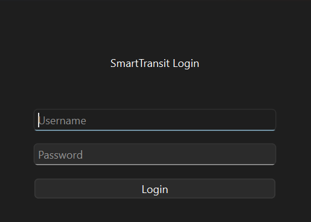
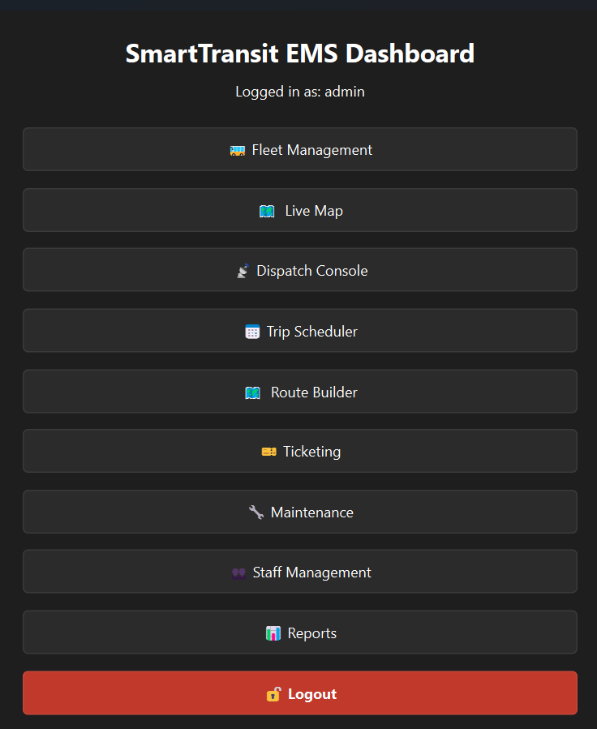
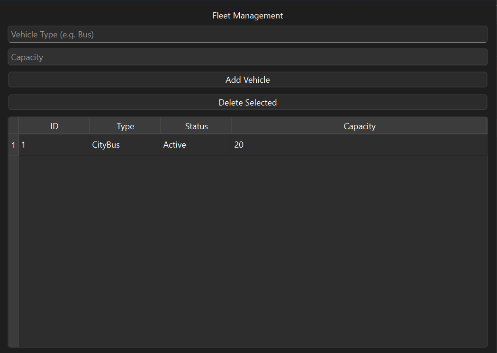
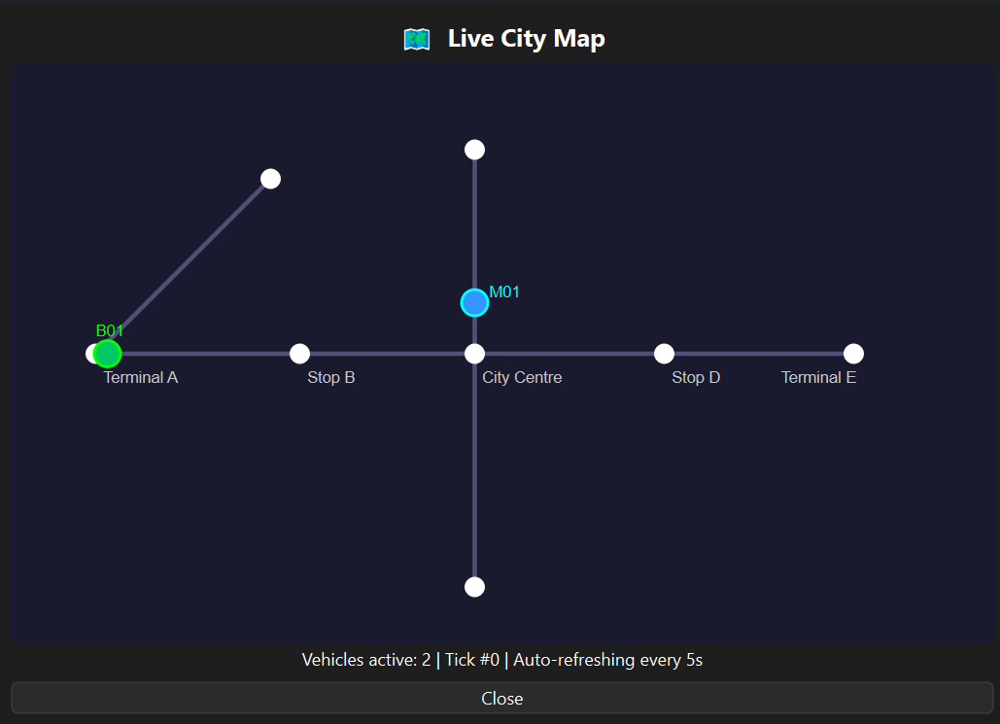
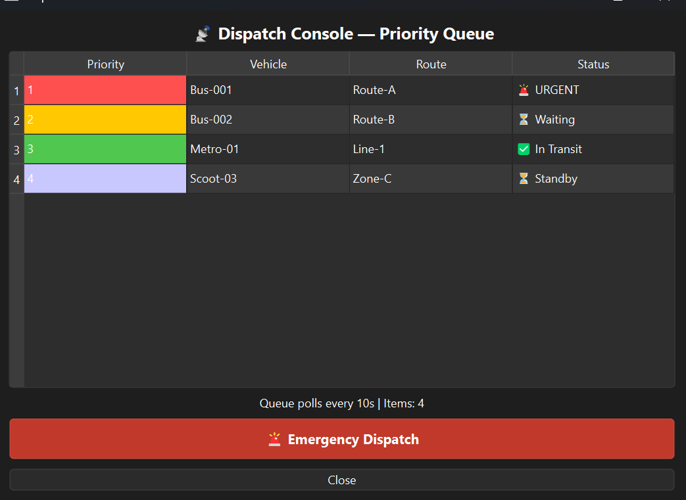
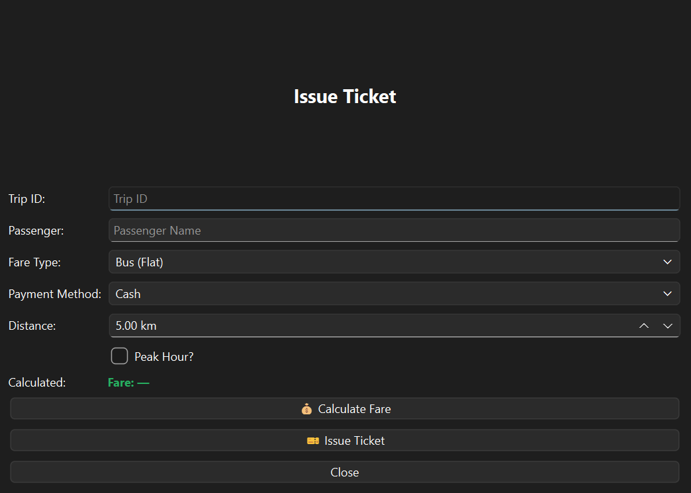
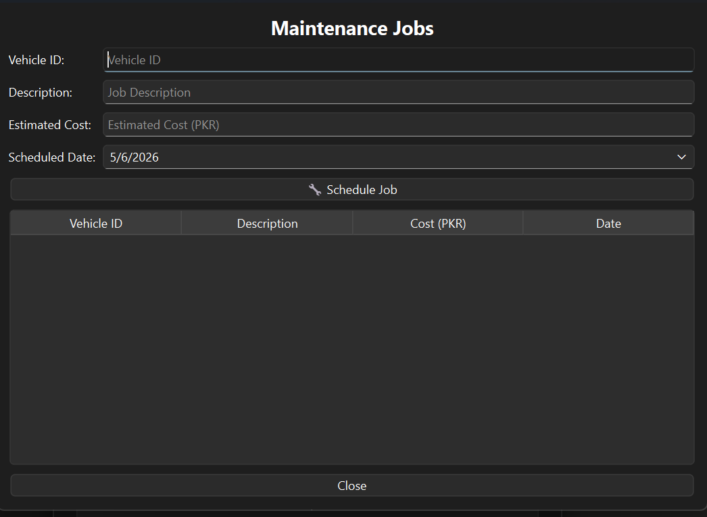
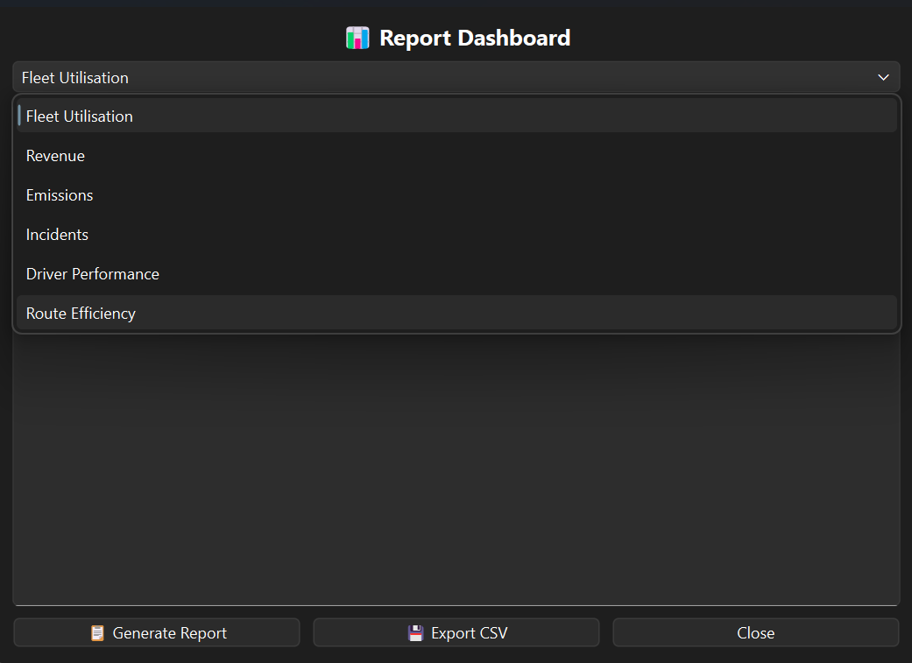

# 🚌 SmartTransit-FleetManager

A modular public transit management platform built in C++17 with a Qt 6 GUI.
Manages the full operational loop — fleet dispatch, route planning, ticketing,
payments, staff scheduling, maintenance, and incident reporting — all through
a clean MVC architecture with zero third-party dependencies beyond Qt.

> **Just want to run it?** Grab the latest build from [Releases](../../releases).

---

## Features

- 🚍 **Fleet Management** — Add, update, and retire vehicles across 8 types (buses, metro, scooters, freight and more)
- 🗺️ **Route Builder** — Create routes, manage stops, and find optimal paths via a custom Graph + Dijkstra implementation
- ⚡ **Real-Time Dispatch** — Assign vehicles to trips using a MinHeap priority queue ordered by departure time
- 🎫 **Ticketing** — Issue, validate, and cancel passenger tickets with full trip linkage
- 💳 **Payment Processing** — 5 pluggable payment methods: Cash, Transit Card, QR Code, Corporate Account, Loyalty Points
- 👷 **Staff Management** — Hire drivers and conductors, assign shifts, track clock-in/out
- 🔧 **Maintenance Tracker** — Log service jobs per vehicle, track full maintenance history
- 🚨 **Incident Reporting** — Report, escalate, and resolve incidents with automatic staff notifications
- 📊 **Reports Dashboard** — Fleet utilisation, revenue, trip stats, and staff analytics
- 💾 **Persistent Storage** — Full serialize/deserialize on every entity — data survives restarts, no database needed

---

## Screenshots

### Login Screen


### Main Dashboard


### Fleet Management


### Route Builder


### Dispatch Console


### Ticketing Window


### Maintenance Tracker


### Reports Dashboard


---

## Architecture

Clean MVC throughout. No business logic leaks into the GUI layer.

    Entity Layer      →   pure domain models, zero Qt dependency
    Controller Layer  →   all business logic, operates on entities
    GUI Layer         →   Qt 6 Widgets, calls controllers only

---

## Project Structure

    SmartTransit-FleetManager/
    ├── include/
    │   ├── entities/
    │   │   ├── Entity.h            # Base — unique ID, timestamp, serialize interface
    │   │   ├── Vehicle.h           # Abstract base with virtual cost/emissions/checks
    │   │   ├── CityBus.h
    │   │   ├── MetroTrain.h
    │   │   ├── ElectricScooter.h
    │   │   ├── FreightTruck.h
    │   │   ├── RideHailCar.h
    │   │   ├── StaffMember.h
    │   │   ├── Driver.h
    │   │   ├── Route.h
    │   │   ├── Trip.h
    │   │   └── Ticket.h
    │   ├── interfaces/
    │   │   ├── IFareCalculator.h   # 5 concrete implementations
    │   │   ├── IPaymentProcessor.h # 5 concrete implementations
    │   │   ├── INotifiable.h
    │   │   └── IReportGenerator.h
    │   ├── controllers/
    │   │   ├── FleetController.h
    │   │   ├── DispatchController.h
    │   │   ├── RouteController.h
    │   │   ├── PaymentController.h
    │   │   ├── AuthController.h
    │   │   ├── TicketingController.h
    │   │   ├── StaffController.h
    │   │   ├── MaintenanceController.h
    │   │   ├── IncidentController.h
    │   │   ├── ReportController.h
    │   │   └── FileController.h
    │   ├── datastructs/
    │   │   ├── DynamicArray.h      # Resizable heap array, doubles on overflow
    │   │   ├── LinkedList.h        # Singly linked list
    │   │   ├── MinHeap.h           # Binary min-heap — drives dispatch priority
    │   │   └── Graph.h             # Adjacency list + Dijkstra — drives routing
    │   ├── exceptions/
    │   │   └── TransitExceptions.h # 35+ typed exceptions under TransitException
    │   └── utils/
    │       ├── CustomString.h      # Heap-managed string, no std::string
    │       ├── CustomDate.h        # Date validation and difference calculation
    │       ├── CustomTime.h        # Time tracking for trips and shifts
    │       └── GeoCoordinate.h     # Lat/lng with Haversine distance
    ├── src/
    ├── screenshots/
    ├── CMakeLists.txt
    └── README.md

---

## Key Design Decisions

**No STL containers**
DynamicArray, LinkedList, MinHeap, and Graph are all custom templates.
Keeps the dependency surface minimal and the data layer fully portable.

**Interface-first extensibility**
New payment method? Implement `IPaymentProcessor`. New fare model? Implement `IFareCalculator`.
Nothing else in the codebase changes.

**Typed exceptions over raw strings**
Every failure mode — from `VehicleOverCapacityException` to `LicenseExpiredException` —
is a named type with message, source, error code, and timestamp. No swallowed context.

**Persistence without a database**
Every entity writes parent fields first, then its own, following the inheritance chain.
The file format is self-documenting and forward-extensible without schema migrations.

---

## Controllers

| Controller | Responsibility |
|---|---|
| FleetController | Vehicle lifecycle, occupancy, depreciation |
| DispatchController | Trip-vehicle assignment via MinHeap |
| RouteController | Stop management, Dijkstra shortest path |
| PaymentController | Pluggable payment via IPaymentProcessor |
| AuthController | Login, session, role-based access |
| TicketingController | Issue, validate, cancel tickets |
| StaffController | Hire, assign, clock-in/out |
| MaintenanceController | Service job logging, history per vehicle |
| IncidentController | Report, escalate, resolve, notify |
| ReportController | Fleet, revenue, trip and staff analytics |
| FileController | Full entity serialization and persistence |

---

## Building from Source

### Prerequisites

| Tool | Version |
|---|---|
| C++ Compiler | GCC 10+ / MSVC 2019+ / Clang 12+ |
| CMake | 3.16 or higher |
| Qt | 6.2 or higher (Widgets module) |

### Windows

    git clone https://github.com/mir-zarak/SmartTransit-FleetManager.git
    cd SmartTransit-FleetManager
    cmake -S . -B build -DBUILD_GUI=ON
    cmake --build build --config Release

Binary will be at `build/Release/SmartTransit.exe`

### Linux / macOS

    git clone https://github.com/mir-zarak/SmartTransit-FleetManager.git
    cd SmartTransit-FleetManager
    cmake -S . -B build -DBUILD_GUI=ON
    cmake --build build
    ./build/SmartTransit

### Core only (no GUI)

    cmake -S . -B build
    cmake --build build

---

## Running the Application

1. Launch the binary
2. Login with default admin credentials:

       Username: admin
       Password: admin123

3. Access is role-based:

| Role | Access |
|---|---|
| Admin | Full access to all modules |
| Dispatcher | Fleet, dispatch, routes, trips |
| Driver | Assigned trips and incident reporting only |

Data saves automatically on exit to a `/data` folder next to the binary.
First run creates the folder with empty data files.

---

## Dependencies

| Library | Purpose | License |
|---|---|---|
| Qt 6 Widgets | GUI layer only | LGPL 3 |
| C++17 stdlib | Everything else | — |

No other dependencies. All data structures, utilities, and domain logic built from scratch.

---

## Roadmap

- [ ] REST API layer over the controller layer
- [ ] SQLite as an alternative persistence backend
- [ ] Unit test suite via GoogleTest
- [ ] Docker build for CI/CD pipeline

---

## Contributors

- Ahmed Umer
- Zarak Mir

---

## License

MIT
```

